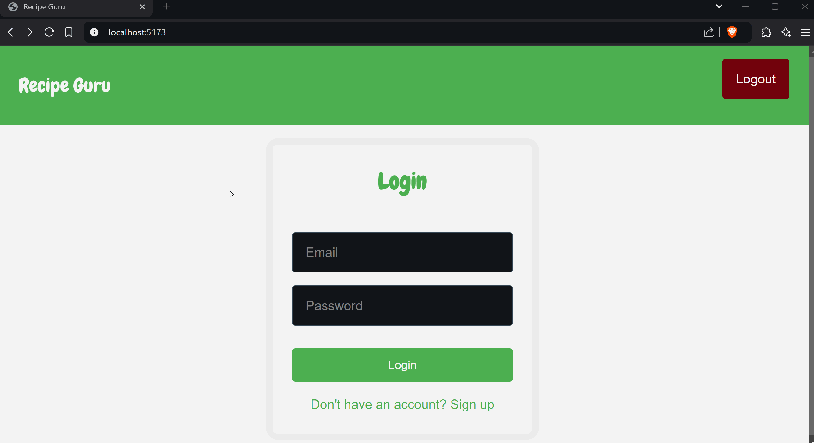

# Recipe Guru powered by AI

🔗 Link to deployed app: [🥗 Recipe Guru](https://recipe-guru.onrender.com)
## About

### Description and Purpose

Recipe Guru is a smart recipe suggestion system designed to help users find recipes based on the ingredients they have available and their dietary preferences (e.g., vegetarian, vegan, gluten-free). The system uses AI to provide tailored recipe suggestions, helping users maximize the use of available ingredients while considering dietary restrictions. Users can save their favorite recipes, view their search history, and manage their profiles. This tool is aimed at enhancing the cooking experience by offering intelligent recipe recommendations.


### Inspiration

The idea behind Recipe Guru was born from the need for a user-friendly tool to make cooking easier by suggesting recipes tailored to the ingredients users have on hand, while also accommodating dietary needs. By leveraging AI and real-time data, Recipe Guru brings convenience and customization to cooking.


## Tech Stack

- **Frontend:** React (JavaScript)
- **Backend:** Express.js (Node.js)
- **Database:** PostgreSQL (via Railway)
- **APIs:** Spoonacular API for recipe and ingredient analysis, Axios for making HTTP requests
- **Hosting:** Render

## **Features**

### **User Account Management**

✅ Users can **sign up, log in, and manage their accounts** seamlessly via the application interface. Account management includes updating personal information and managing preferences.



---

### **Ingredient and Dietary Preference Input**

✅ Users can **input available ingredients** and specify **dietary preferences** (e.g., vegan, vegetarian) to personalize their recipe suggestions.


---

### **Tailored Recipe Suggestions**

✅ Based on the user’s inputs, the system provides **personalized recipe recommendations** through the Spoonacular API, ensuring recipes align with user preferences.


---

### **Favorites Management**

✅ Users can **save their favorite recipes** for quick access and **view their saved recipes**.


---

### **User Authentication and Secure Data Storage**

✅ The system handles **secure user authentication** and stores user data and preferences in **real-time database** for high availability and security.


---


## Installation Instructions

### 1. **Clone the repository from GitHub:**

```bash
git clone <repo-url>
```

### 2. **Navigate into the project folder:**

```bash
cd recipe-guru
```

### 3. **Install dependencies for both React (frontend) and Node.js (backend):**


```bash
npm install
```

### 4. **Set up environment variables:**

Check for a `.env.example` file in the root folder. Copy it to create your own `.env` file:

```bash
cp .env.example .env
```
Then, fill in any required environment variables.


### 5. **Run the db setup command to setup the database:**

```bash
npm run setup-db
```

### 6. **Run the build command:**

```bash
npm run build
```

### 7. **Run the backend server:**

```bash
npm run start
```
